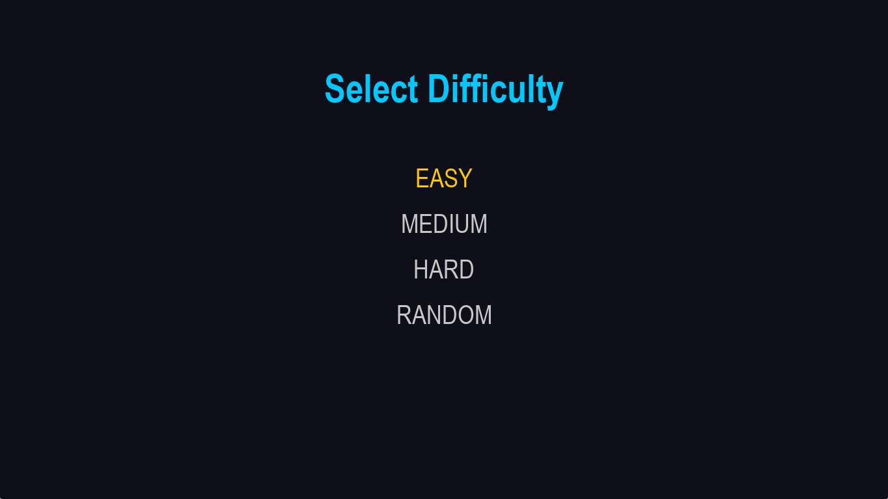
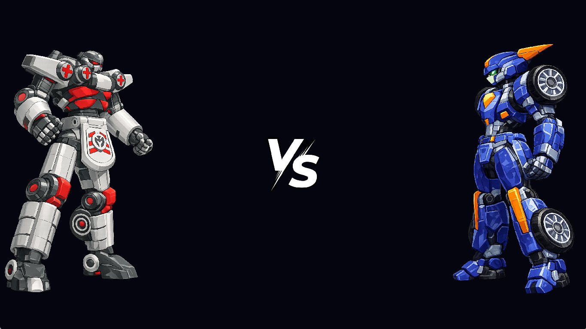
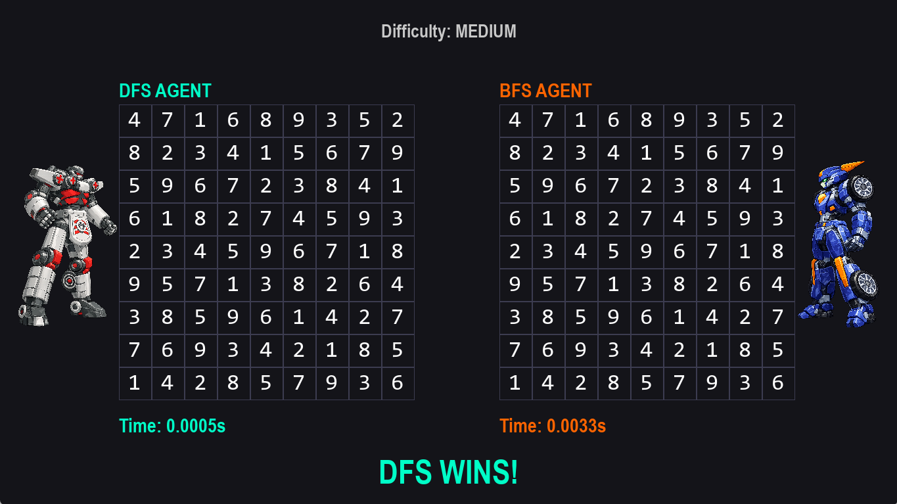

# Intelligent Sudoku Solver with Competing AI Agents

A fullscreen interactive application where two AI agents — DFS and BFS — compete in real time to solve the same Sudoku puzzle. Built with Python and Pygame.

---

## Screenshots








---

## Features

- Two competing AI agents solve the same board simultaneously
- Live step-by-step animation of each agent's solving process
- Winner determined by solve time, displayed at the end
- Four difficulty levels: Easy, Medium, Hard, and Random
- Puzzles fetched from a live API with a local fallback generator
- Fullscreen dark-themed GUI built with Pygame

---

## How It Works

1. Launch the app and press Enter on the start screen
2. Select a difficulty level using the arrow keys
3. The app fetches a Sudoku puzzle from the API
4. Both agents calculate their solutions in background threads
5. The animation plays showing each agent filling the board
6. Solve times are compared and the winner is announced

---

## Algorithms

**DFS Agent** uses recursive Depth-First Search with backtracking. It places numbers one at a time and backtracks when it reaches a dead end. It is fast and memory-efficient.

**BFS Agent** uses Breadth-First Search, exploring board states level by level via a queue. It includes a 15-second timeout to handle complex boards gracefully.

---

## Project Structure

```
intelligent-sudoku-solver-with-ai-agents/
│
├── main.py                    # Entry point
│
├── agents/
│   ├── bfs_agent.py           # BFS solving agent
│   └── dfs_agent.py           # DFS solving agent with backtracking
│
├── gui/
│   ├── start_screen.py        # Title screen
│   ├── difficulty_screen.py   # Difficulty selection screen
│   ├── versus_screen.py       # VS intro screen
│   ├── game_screen.py         # Main game loop and animation
│   └── grid_ui.py             # Sudoku grid renderer
│
├── utils/
│   ├── api.py                 # Fetches puzzles from external API
│   ├── sudoku_generator.py    # Local puzzle generator (fallback)
│   ├── validator.py           # Move validation for agents
│   └── solutions.py           # Solution utilities
│
├── assets/                    # Robot images and VS screen visuals
├── screenshots/               # GUI screenshots
└── requirements.txt           # Dependencies
```

---

## Getting Started

### Prerequisites

- Python 3.10 or higher
- pip

### Installation

```bash
# Clone the repository
git clone https://github.com/Adan756/intelligent-sudoku-solver-with-competing-ai-agents-.git

# Navigate into the project folder
cd intelligent-sudoku-solver-with-competing-ai-agents-

# Create and activate a virtual environment (optional but recommended)
python -m venv venv
venv\Scripts\activate        # Windows
source venv/bin/activate     # Mac / Linux

# Install dependencies
pip install -r requirements.txt

# Run the application
python main.py
```

---

## Controls

| Key | Action |
|-----|--------|
| Enter / Right Arrow | Confirm / go to next screen |
| Left Arrow | Go back |
| Up / Down Arrow | Navigate difficulty options |
| Enter (during game) | Skip animation and jump to result |

---

## Dependencies

| Package | Purpose |
|---------|---------|
| pygame | GUI rendering and game loop |
| requests | Fetching puzzles from the Sudoku API |

---

## Sudoku API

Puzzles are fetched from:

```
https://sudoku-api.vercel.app/api/dosuku?difficulty={difficulty}
```

If the API is unavailable or times out, the app falls back to a locally generated puzzle using a randomized backtracking solver.

---

## Authors

Developed as an AI Mini Project (Project I)

---

## License

This project is for educational purposes only.
